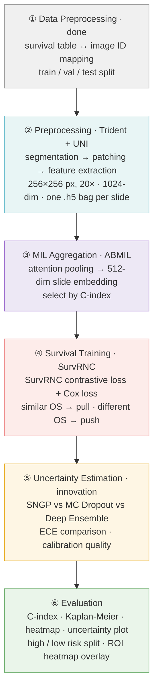

# Uncertainty-Aware Histopathology Survival Analysis

Comparing MC-Dropout, Deep Ensembles, and SNGP for uncertainty-aware survival prediction from TCGA-LUAD & TCGA-GBMLGG whole-slide pathology images.

## Pipeline

## Datasets

Diagnostic whole-slide images were downloaded from the [NCI Genomic Data Commons](https://portal.gdc.cancer.gov/) using open-access, SVS, slide-image, and diagnostic-slide filters. See [data/README.md](data/README.md) for dataset details, filtering criteria, and cohort composition.

| Dataset | Projects | Cases | Slides | Manifest |
|---|---|---:|---:|---|
| TCGA Lung Adenocarcinoma | TCGA-LUAD | 478 | 541 | [gdc_manifest_full_luad_dx.txt](../manifests/gdc_manifest_full_luad_dx.txt) |
| TCGA Glioma | TCGA-GBM, TCGA-LGG | 879 | 1,703 | [gdc_manifest_full_gbmlgg_dx.txt](../manifests/gdc_manifest_full_gbmlgg_dx.txt) |

## Results

## Contributors
| Name                 | University                             | Profile                                                                         |
|----------------------| -------------------------------------- |---------------------------------------------------------------------------------|
| Robert Pearce        | University of Nevada, Las Vegas        | [robertxpearce.com](https://robertxpearce.com/)                                 |
| Sejun Park           | Gyeonggi Science Technology University | [LinkedIn](https://www.linkedin.com/in/sejun-park-32bb0a3a5/)                                                                    |
| Hailey (Heejae Kwon) | Sookmyung Womens University            |                                                                             |
| HyeonKyeong Lee      | Gyeongsang National University         | [LinkedIn](https://www.linkedin.com/in/%ED%98%84%EA%B2%BD-%EC%9D%B4-7022b641a/) |

## Acknowledgments
This project was completed during the International AI & Machine Learning Summer Camp hosted by the [University of Nevada, Las Vegas](https://www.unlv.edu/cs). Resources and guidance were provided by [Dr. Mingon Kang](https://kang.dataxlab.org/index.php).

## References

Zhang, Andrew, et al. "Accelerating data processing and benchmarking of ai models for pathology." arXiv preprint arXiv:2502.06750 (2025).

Chen, Richard J et al. “Towards a general-purpose foundation model for computational pathology.” Nature medicine vol. 30,3 (2024): 850-862. doi:10.1038/s41591-024-02857-3

Lu, Ming Y et al. “A visual-language foundation model for computational pathology.” Nature medicine vol. 30,3 (2024): 863-874. doi:10.1038/s41591-024-02856-4

Ilse, M., Tomczak, J. &amp; Welling, M.. (2018). Attention-based Deep Multiple Instance Learning. Proceedings of the 35th International Conference on Machine Learning, in Proceedings of Machine Learning Research 80:2127-2136

Shao, Zhuchen, et al. ‘TransMIL: Transformer Based Correlated Multiple Instance Learning for Whole Slide Image Classification’. Advances in Neural Information Processing Systems, edited by M. Ranzato et al., vol. 34, Curran Associates, Inc., 2021, pp. 2136–2147, proceedings.neurips.cc/paper_files/paper/2021/file/10c272d06794d3e5785d5e7c5356e9ff-Paper.pdf.

Saeed, Numan, et al. ‘SurvRNC: Learning Ordered Representations for Survival Prediction Using Rank-N-Contrast’. arXiv [Cs.CV], 2024, arxiv.org/abs/2403.10603. arXiv.

Liu, Jeremiah Zhe, et al. ‘Simple and Principled Uncertainty Estimation with Deterministic Deep Learning via Distance Awareness’. CoRR, vol. abs/2006.10108, 2020, arxiv.org/abs/2006.10108.

Meleti, Uma, and Jeffrey J. Nirschl. ‘Uncertainty-Aware Image Classification in Biomedical Imaging Using Spectral-Normalized Neural Gaussian Processes’. 2026 IEEE 23rd International Symposium on Biomedical Imaging (ISBI), IEEE, 2026, pp. 1–4, https://doi.org/10.1109/isbi61048.2026.11515555.

Gal, Yarin, and Zoubin Ghahramani. ‘Dropout as a Bayesian Approximation: Representing Model Uncertainty in Deep Learning’. arXiv [Stat.ML], 2016, arxiv.org/abs/1506.02142. arXiv.

Lakshminarayanan, Balaji, et al. ‘Simple and Scalable Predictive Uncertainty Estimation Using Deep Ensembles’. arXiv [Stat.ML], 2017, arxiv.org/abs/1612.01474. arXiv.