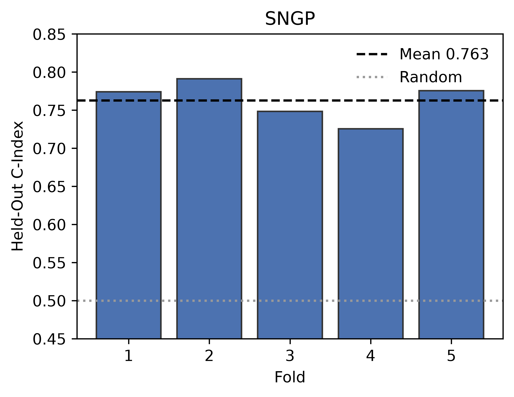
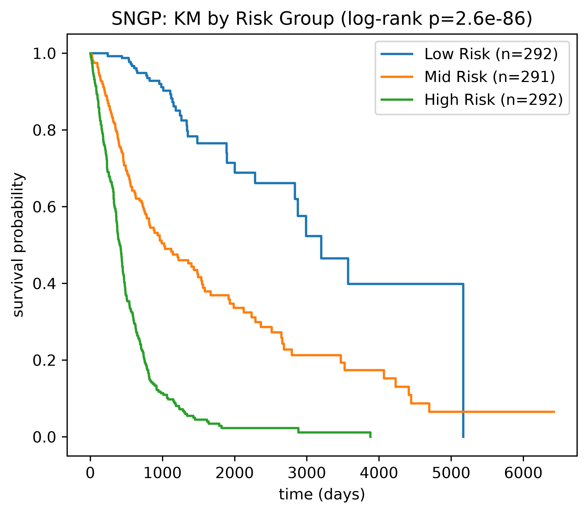
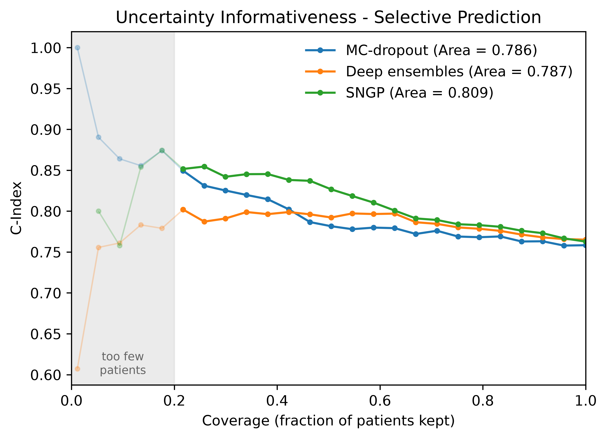
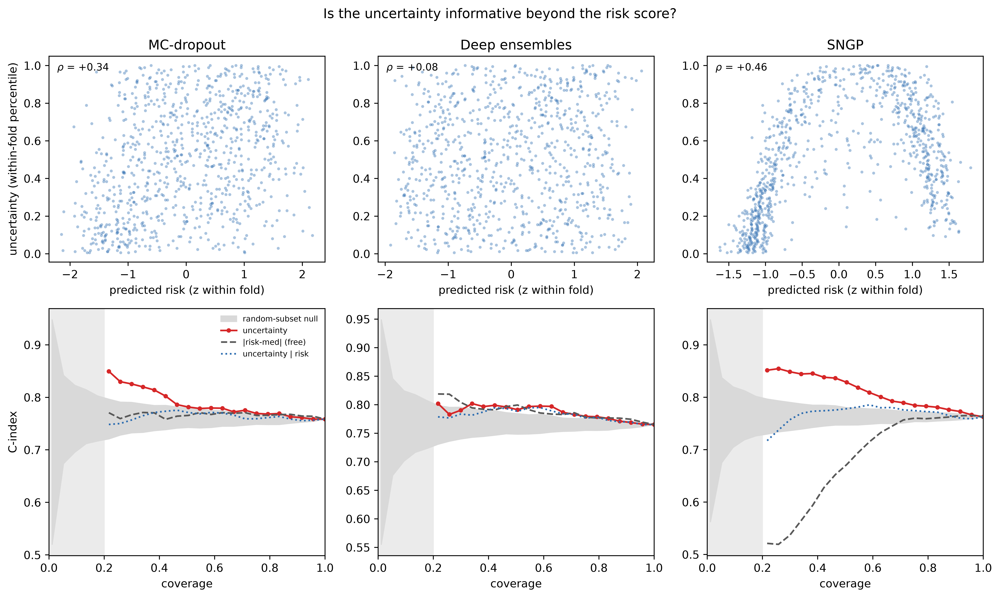
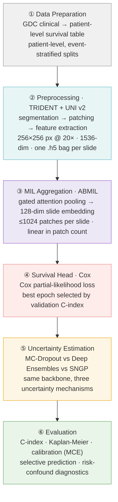

# Uncertainty-Aware Histopathology Survival Analysis

Comparing MC-Dropout, Deep Ensembles, and SNGP as uncertainty estimators for survival
prediction from whole-slide pathology images, on TCGA-GBMLGG (glioma).

All three use the same backbone: frozen [UNI v2](https://doi.org/10.1038/s41591-024-02857-3)
patch features, gated-attention MIL pooling, and a Cox proportional-hazards head. The
comparison isolates the uncertainty method, not the architecture.

The three are indistinguishable on ranking accuracy (C-index $\approx$ 0.76), so the differences are
in the quality and cost of their uncertainty. SNGP has the most informative uncertainty and
the best calibration in one forward pass, against 100 for MC-dropout and 5 trained models for
ensembles. Its uncertainty is also the least independent of its own risk score.

## Results

5-fold, patient-level, event-stratified cross-validation over 875 patients (175 per fold,
445 events). All numbers are out-of-fold.

| Method | C-index (fold mean $\pm$ sd) | Pooled C-index (95% CI) | MCE $downarrow$ | Selective area $\uparrow$ | C-index @ 20% coverage | Models trained | Passes at inference |
|---|-----------------------------:|---:|-------:|--------------------------:|-----------------------:|---:|---:|
| MC-Dropout |            0.758 $\pm$ 0.019 | 0.758 (0.735–0.780) |  0.054 |                     0.786 |                  0.849 | 1 | 100 |
| Deep Ensembles |            0.765 $\pm$ 0.020 | 0.765 (0.744–0.786) |  0.042 |                     0.786 |                  0.802 | 5 | 5 |
| SNGP |            0.763 $\pm$ 0.026 | 0.763 (0.742–0.784) |  0.038 |                     0.809 |                  0.852 | 1 | 1 |

C-index: fraction of comparable patient pairs ordered correctly (0.5 = chance). MCE: mean
calibration error against a Breslow baseline, averaged over 1/3/5-year horizons. Selective
area: accuracy gain as the least-confident patients are withheld, floored at 20% coverage.

### Discrimination

All three land at C-index $\approx$ 0.76 and are stable across folds. They share a backbone, so this
measures the shared model more than the uncertainty method.



### Risk Stratification

Predicted-risk tertiles separate observed survival in the correct order for every method.
Median survival is 8.8 / 2.6 / 1.1 years for low / mid / high risk, log-rank p < 1e-72.
GBMLGG spans two biologically distinct diseases and n is large, so these p-values are a
sanity check rather than an effect size, and they do not rank the three methods.



### Selective Prediction

Withholding the patients each model is least confident about raises accuracy for all three,
above a random-subset null. SNGP climbs highest (area 0.809; C-index 0.852 at 20% coverage).



### Uncertainty vs. Risk

If uncertainty is only a proxy for mid-range risk, then filtering by confidence keeps the easy
patients and the UQ adds nothing. Regressing the risk-predictable component out of each
uncertainty and re-ranking on the residual:

| Method | p(Uncertainty, Risk) | Var. Explained by Risk | Selective Area After Removing Risk |
|---|---------------------:|-----------------------:|-----------------------------------:|
| MC-Dropout |                +0.34 |                    12% |                              0.763 |
| Deep Ensembles |                +0.08 |            $\approx$0% |                              0.782 |
| SNGP |                +0.46 |                    64% |                              0.769 |

SNGP has the biggest lift but the least risk-independent uncertainty. Deep ensembles have the
most independent uncertainty, but a risk-only baseline nearly matches their lift.



## Pipeline



## Model

| Component | Setting                                                                                                      |
|---|--------------------------------------------------------------------------------------------------------------|
| Patch encoder | UNI v2, frozen $\cdot$ 1536-dim per patch $\cdot$ 256×256 px @ 20×                                           |
| Patches per slide | $\le$ 1024                                                                                                   |
| MIL pooling | ABMIL, gated attention $\cdot$ attention dim 128 $\cdot$ dropout 0.25 $\cdot$ LayerNorm on raw patch features |
| Slide embedding | 128-dim                                                                                                      |
| Head | Linear $\rightarrow$ scalar Cox risk score                                                                   |
| Loss | Cox negative partial log-likelihood                                                                          |
| Optimiser | AdamW $\cdot$ lr 5e-5 $\cdot$ weight decay 1e-3 $\cdot$ grad clip 1.0                                        |
| Schedule | $\le$ 50 epochs $\cdot$ min 3 $\cdot$ early stopping patience 5 on validation C-index                        |
| CV | 5-fold, patient-level, event-stratified $\cdot$ 25% of train held out for validation $\cdot$ seed 42                      |

MC-Dropout keeps dropout active at inference and takes 100 samples. Deep Ensembles trains 5
independent models from different seeds. SNGP replaces the head with a Gaussian-process output
layer (1024 random features, ridge penalty 1.0) over a spectral-normalised backbone (norm bound
0.95), giving uncertainty in a single deterministic pass.

C-index is not the training objective: it counts pairwise comparisons and has no usable
gradient. The Cox partial likelihood is a differentiable surrogate for the same ranking goal,
and C-index only selects the best epoch.

The [SurvRNC](https://arxiv.org/abs/2403.10603) rank-N-contrast loss is implemented in
[`src/losses/survrnc.py`](src/losses/survrnc.py) as an auxiliary embedding loss
(`L = L_cox + β·L_survrnc`), but is disabled for every result reported here (`LAMBDA_RNC = 0.0`).

## Datasets

Diagnostic whole-slide images were downloaded from the [NCI Genomic Data Commons](https://portal.gdc.cancer.gov/)
using open-access, SVS, slide-image, and diagnostic-slide filters. Filtering criteria and cohort
composition: [data/README.md](data/README.md).

| Dataset | Projects | Cases | Slides | Manifest | Status |
|---|---|---:|---:|---|---|
| TCGA Glioma | TCGA-GBM, TCGA-LGG | 879 | 1,703 | [gdc_manifest_full_gbmlgg_dx.txt](manifests/gdc_manifest_full_gbmlgg_dx.txt) | Reported above (one slide per patient; 875 patients across 5 folds) |
| TCGA Lung Adenocarcinoma | TCGA-LUAD | 478 | 541 | [gdc_manifest_full_luad_dx.txt](manifests/gdc_manifest_full_luad_dx.txt) | Preprocessed; not part of the current results |

## Repository layout

```
src/          Importable package: data → model → loss → train → eval  (see src/README.md)
scripts/      Runnable stages: data prep, feature extraction, training, tuning, eval
notebooks/    Analysis; publication_figures.ipynb regenerates every figure above
results/      Per-method CV predictions, summaries, figures, and diagrams
data/         Survival tables, splits, and (gitignored) slides + features
manifests/    GDC download manifests
TRIDENT/      Vendored WSI preprocessing toolkit
```

## Contributors
| Name                 | University                             | Profile                                                                         |
|----------------------| -------------------------------------- |---------------------------------------------------------------------------------|
| Robert Pearce        | University of Nevada, Las Vegas        | [robertxpearce.com](https://robertxpearce.com/)                                 |
| Sejun Park           | Gyeonggi Science Technology University | [LinkedIn](https://www.linkedin.com/in/sejun-park-32bb0a3a5/)                                                                    |
| Hailey (Heejae Kwon) | Sookmyung Womens University            | [LinkedIn](https://www.linkedin.com/in/%ED%9D%AC%EC%9E%AC-%EA%B6%8C-a28abb422/)                                                                            |
| HyeonKyeong Lee      | Gyeongsang National University         | [LinkedIn](https://www.linkedin.com/in/%ED%98%84%EA%B2%BD-%EC%9D%B4-7022b641a/) |

## Acknowledgments
This project was completed during the International AI & Machine Learning Summer Camp hosted by the [University of Nevada, Las Vegas](https://www.unlv.edu/cs). Resources and guidance were provided by [Dr. Mingon Kang](https://kang.dataxlab.org/index.php).

## References

Zhang, Andrew, et al. "Accelerating data processing and benchmarking of ai models for pathology." arXiv preprint arXiv:2502.06750 (2025).

Chen, Richard J et al. “Towards a general-purpose foundation model for computational pathology.” Nature medicine vol. 30,3 (2024): 850-862. doi:10.1038/s41591-024-02857-3

Lu, Ming Y et al. “A visual-language foundation model for computational pathology.” Nature medicine vol. 30,3 (2024): 863-874. doi:10.1038/s41591-024-02856-4

Ilse, M., Tomczak, J. &amp; Welling, M.. (2018). Attention-based Deep Multiple Instance Learning. Proceedings of the 35th International Conference on Machine Learning, in Proceedings of Machine Learning Research 80:2127-2136

Shao, Zhuchen, et al. ‘TransMIL: Transformer Based Correlated Multiple Instance Learning for Whole Slide Image Classification’. Advances in Neural Information Processing Systems, edited by M. Ranzato et al., vol. 34, Curran Associates, Inc., 2021, pp. 2136–2147, proceedings.neurips.cc/paper_files/paper/2021/file/10c272d06794d3e5785d5e7c5356e9ff-Paper.pdf.

Saeed, Numan, et al. ‘SurvRNC: Learning Ordered Representations for Survival Prediction Using Rank-N-Contrast’. arXiv [Cs.CV], 2024, arxiv.org/abs/2403.10603. arXiv.

Liu, Jeremiah Zhe, et al. ‘Simple and Principled Uncertainty Estimation with Deterministic Deep Learning via Distance Awareness’. CoRR, vol. abs/2006.10108, 2020, arxiv.org/abs/2006.10108.

Meleti, Uma, and Jeffrey J. Nirschl. ‘Uncertainty-Aware Image Classification in Biomedical Imaging Using Spectral-Normalized Neural Gaussian Processes’. 2026 IEEE 23rd International Symposium on Biomedical Imaging (ISBI), IEEE, 2026, pp. 1–4, https://doi.org/10.1109/isbi61048.2026.11515555.

Gal, Yarin, and Zoubin Ghahramani. ‘Dropout as a Bayesian Approximation: Representing Model Uncertainty in Deep Learning’. arXiv [Stat.ML], 2016, arxiv.org/abs/1506.02142. arXiv.

Lakshminarayanan, Balaji, et al. ‘Simple and Scalable Predictive Uncertainty Estimation Using Deep Ensembles’. arXiv [Stat.ML], 2017, arxiv.org/abs/1612.01474. arXiv.
