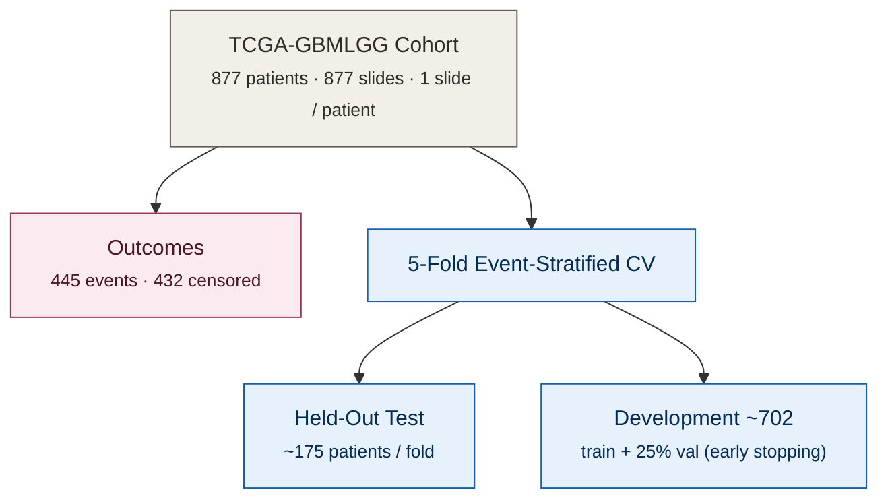
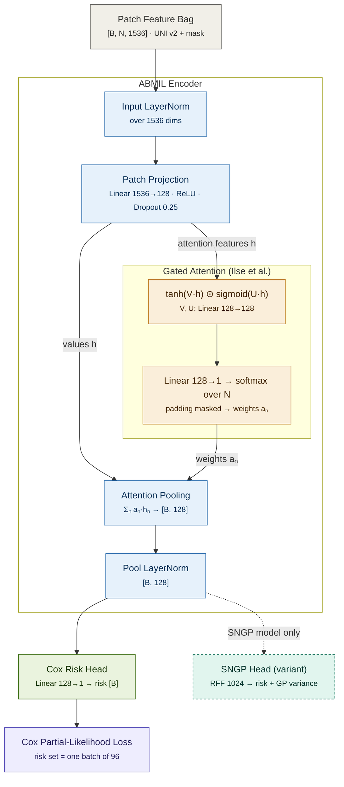
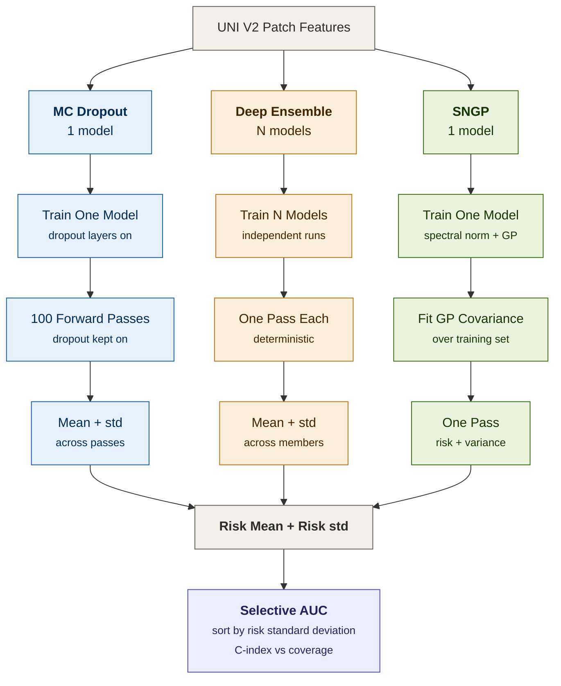
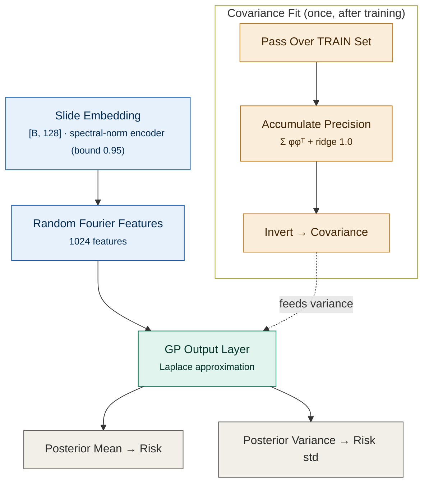
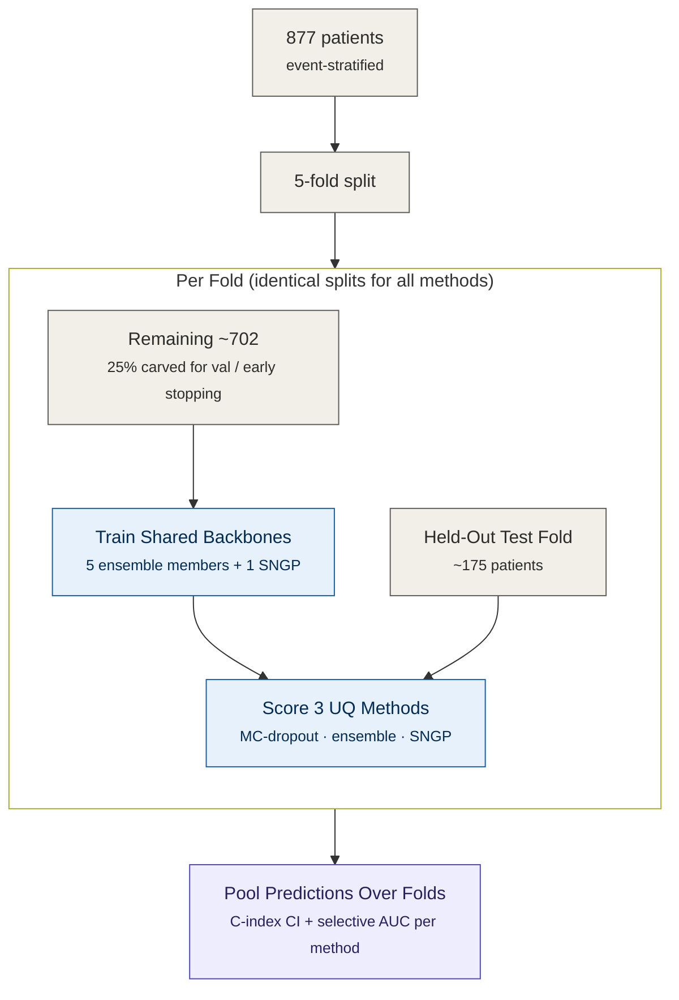
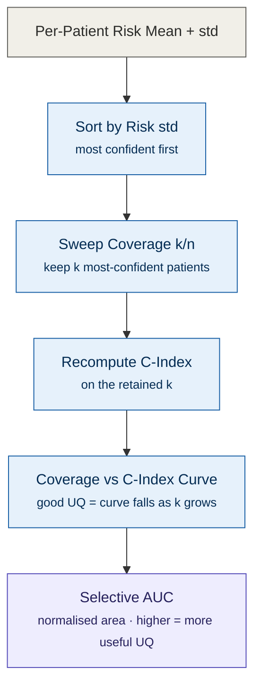

# Mermaid Diagrams

## Study Overview

```mermaid
flowchart LR
    A["WSIs<br/><small>TCGA-GBMLGG · 877 patients</small>"]
    B["UNI v2 Features<br/><small>[N, 1536] per slide</small>"]
    C["ABMIL + Cox Backbone<br/><small>attention MIL → risk score</small>"]
    D["Uncertainty Methods<br/><small>MC-dropout · ensemble · SNGP</small>"]
    E["Risk + Uncertainty<br/><small>risk mean and std</small>"]
    F["Evaluation<br/><small>C-index · selective AUC · 5-fold CV</small>"]
    A --> B --> C --> D --> E --> F
    classDef io   fill:#F1EFE8,stroke:#5F5E5A,color:#2C2C2A;
    classDef data fill:#E6F1FB,stroke:#185FA5,color:#042C53;
    classDef model fill:#E1F5EE,stroke:#0F6E56,color:#04342C;
    classDef uq   fill:#FAEEDA,stroke:#BA7517,color:#412402;
    classDef eval fill:#EEEDFE,stroke:#534AB7,color:#26215C;
    class A io;
    class B data;
    class C model;
    class D uq;
    class E io;
    class F eval;
```

## Cohort Flow GBMLGG

## Feature Extraction Pipeline

## ABMIL Cox Architecture Diagram

## Uncertainty Quantification Methods Pipeline

## SNGP GP Head

## Cross Validation Design

## Selective Prediction Explainer

